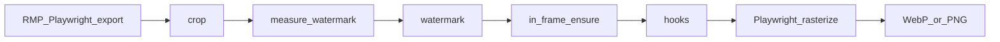

# rmp-export-action

English | [➡️ 简体中文](README.md)


> The following content was partially generated by Cursor Auto and has been manually reviewed and modified.

GitHub Action and CLI that automate export of [Rail Map Painter](https://github.com/railmapgen/rmp) project JSON to SVG, WebP, or PNG, as part of larger automation workflows.

The action clones a specified RMP version, starts it in a browser, drives the export UI with Playwright on your behalf, post-processes SVG (crop, watermark repositioning, custom scripts), and generates WebP or PNG when configured.

> [!WARNING]
>
> Using this tool to export maps automatically requires you to comply with the **export terms** RMP applies to that version. **The terms text follows the RMP version in effect when the action runs.**
>
> During export, this tool checks RMP’s export-terms agreement on your behalf. Setting `acceptRmpExportTermsForRef` to **exactly match** `rmp.ref` **means you agree to that delegation.**

## Quick start

Suppose you have a GitHub repository with an RMP archive and want to export map images automatically on semantic version tags and create releases.

**Steps**

1. Download [`example/rmp-release-config.yml`](example/rmp-release-config.yml) and copy it to the repository root as `rmp-release-config.yml`. Change `RMP.json` in the file to the path relative to the repository root. Actions must be enabled on the repository (enabled by default on new repositories).
2. Set `acceptRmpExportTermsForRef` to the same value as `rmp.ref`. **By setting this field, you agree that this tool may check RMP’s export-terms agreement on your behalf during the run.**
3. Download [`example/release.yml`](example/release.yml) and copy it to `.github/workflows/release.yml` in your repository.
4. Commit and push the changes to GitHub.
5. Create and push a semantic version tag locally, for example `git tag v0.1.0 && git push origin v0.1.0` (adjust the version as needed). The version will be written to the `%version%` placeholder in your RMP archive with a `v` prefix (e.g. `v0.1.0`).
6. When the workflow runs successfully, open **Releases** on the repository (in the right sidebar on the repository home page) to view the new version. You can download SVG, WebP, or PNG from the release attachments, and see raster images inline in the release notes.

## Parameters

### GitHub Action inputs

| Input | Meaning | Required | Default | Description |
|-------|---------|----------|---------|-------------|
| `version` | Version number | yes | — | Release version; see [Placeholders](#placeholders-version--datetime) below |
| `config` | Config file path | no | `rmp-release-config.yml` | Path to release config (relative to the calling repository root) |
| `export-id` | Export only one target | no | — | Must match the `id` of an entry under `exports` in the config |
| `dry-run` | Trial run without generating outputs | no | `false` | Set to `"true"` to log the plan only |

```yaml
- uses: Unnamed2964/rmp-export-action@v0
  with:
    version: "0.6.3"
    config: rmp-release-config.yml
    # export-id: map
    # dry-run: "true"
```

### `rmp-release-config.yml` configuration example

Paths in the config are relative to the config file's parent directory.

```yaml
# acceptRmpExportTermsForRef: See the warning at the top; must exactly match rmp.ref
acceptRmpExportTermsForRef: rmp-6.0.22

rmp:
  # repository: Git URL of the RMP repository
  repository: https://github.com/railmapgen/rmp.git
  # ref: RMP version tag to use
  # Recommended: the RMP version you are currently using.
  # This repository does not guarantee that its UI automation will work with future RMP versions
  # If that happens, rolling back to a version this repository supports may be a temporary workaround
  ref: rmp-6.0.22

# defaults: Optional fallbacks for scale / whiteBackground when an export omits them
# If neither defaults nor an export sets a value: scale defaults to 2.0, whiteBackground to true
defaults:
  # scale: Playwright device scale factor for the export session and WebP resolution
  scale: 2.0
  # whiteBackground: When true, WebP/PNG use a white background; otherwise transparent
  whiteBackground: true

# exports: List of export targets; each maps one source file to output paths
exports:
  # id: Export target name
  # skip: When true, skip this entry
  - id: map
    # source: Path to the RMP archive
    source: RMP.json
    # scale / whiteBackground: Optional per-export overrides (e.g. different maps with different canvas sizes)
    # scale: 2.5
    # whiteBackground: false
    # outputs: Output file paths in the workflow; set at least one of svg, webp, or png
    outputs:
      # svg: Optional; omit to keep SVG as an internal intermediate only
      svg: RMP.svg
      # webp: Optional; omit to skip WebP generation
      webp: RMP.webp
      # png: Optional; omit to skip PNG generation
      # png: RMP.png
    # crop: Optional; when present, crops the output using RMP coordinates
    # In RMP, move new stations or virtual nodes to the intended top-left and bottom-right corners of the crop region, note their coordinates, and use them to fill in the values below
    crop:
      # x: Top-left x of the crop region
      x: 0
      # y: Top-left y of the crop region
      y: 0
      # width: Crop region width; bottom-right x minus top-left x
      width: 1000
      # height: Crop region height; bottom-right y minus top-left y
      height: 1000
    # watermark: Optional; moves the RMP watermark to the specified position; if the position falls outside the crop region (visible area), it is moved to the nearest in-frame position with a warning
    watermark:
      # anchor: Which canvas corner to align to — bottom-right / bottom-left / top-right / top-left
      anchor: bottom-right
      # inset: Gap between the watermark bbox and the corresponding edge of the crop region (visible area)
      inset:
        x: 27
        y: 55
    # postProcess: Optional; when present, runs after crop/watermark and before WebP generation
    # postProcess:
    #   hooks:
    #     - type: command
    #       run: python3 scripts/my_hook.py RMP.svg
```

### Placeholders `%version%` / `%datetime%`

You can type `%version%` and `%datetime%` anywhere in your RMP archive (they may sit directly next to other characters without spaces). This tool replaces them with actual values at run time. Commonly used for version labels or “last updated” text on the map.

| Placeholder | Replaced with | Source |
|-------------|---------------|--------|
| `%version%` | Version with a `v` prefix, e.g. `v0.6.3` | The workflow `version` input |
| `%datetime%` | Export time, e.g. `2026-08-31T12:00:00` | Generated at the start of the run (Asia/Shanghai) |

## Troubleshooting

| Symptom / log | Likely cause | Suggested action |
|---------------|--------------|------------------|
| `acceptRmpExportTermsForRef is required` | Terms confirmation field unset | Read the RMP export terms for that version and set the field; see the warning at the top |
| `acceptRmpExportTermsForRef (...) must match rmp.ref (...)` | Terms field out of sync after ref change | Re-read terms for the RMP version in `ref` and set both fields to the same value; see the warning at the top |
| `exports must not be empty` | Empty `exports` list | Add at least one entry under `exports` |
| `rmp.repository and rmp.ref are required` | Missing required fields under `rmp` | Set `repository` and `ref` under `rmp` correctly |
| `No export target matched` | `export-id` does not match any `exports[].id` | Align the workflow input with your config |
| `Hook failed: ...` | Post-process script failed | Check script paths under `postProcess` in `rmp-release-config.yml`; if you do not use hooks, remove any accidental `hooks` block |
| `Timed out waiting for` RMP URL | Slow clone/install or invalid `rmp.ref` | On the repository **Actions** tab, open the failed run and read the log; check that `rmp.ref` is spelled correctly and that the tag exists on the RMP repository |
| Playwright timeout / `session-open-failure` | RMP failed to start or load | Same as above — read the Actions log; confirm `rmp.ref` is valid. This action may not support that RMP version yet; report on [Issues](https://github.com/Unnamed2964/rmp-export-action/issues) |
| `export-failure` | RMP UI error during SVG export | Automation was developed against RMP 6.0.22 and may not support future RMP versions; if you recently upgraded `rmp.ref`, roll back to the previous version and report on [Issues](https://github.com/Unnamed2964/rmp-export-action/issues) |
| `rasterize-failure` / `SVG missing viewBox and width/height` | SVG-to-WebP/PNG conversion failed | Check whether `crop` coordinates look reasonable; try removing `crop` once to test |
| `Unknown watermark anchor` / `watermark requires absolute or anchor+inset` | Invalid watermark config | Check your `watermark` configuration |
| CI output differs from local Windows | **Known issue** ([#1](https://github.com/Unnamed2964/rmp-export-action/issues/1)): CI and Windows use different fonts, so Chinese layout may differ from local RMP preview | Treat SVG/WebP in the Release attachments as canonical; see [#1](https://github.com/Unnamed2964/rmp-export-action/issues/1) for background |
| Release / Artifacts missing attachments | Upload step or path misconfigured | Compare your workflow upload paths with [`example/release.yml`](example/release.yml) or [`example/export-map.yml`](example/export-map.yml) |

## Advanced topics

Details not covered above.

### Post-process scripts

`postProcess.hooks` run after crop and watermark steps and before WebP generation. They can invoke any shell command to modify the SVG. The literal `RMP.svg` in `run` is replaced with the actual SVG output path for that export target.

For example, [yanji-rail-transit-fiction](https://github.com/Unnamed2964/yanji-rail-transit-fiction) calls `scripts/adjust_zh_dy.py` in its [`rmp-release.yml`](https://github.com/Unnamed2964/yanji-rail-transit-fiction/blob/main/rmp-release.yml) to raise Chinese station-name `dy` by 1px in the exported SVG to avoid overlap between Chinese and Korean text:

```yaml
postProcess:
  hooks:
    - type: command
      run: python3 scripts/adjust_zh_dy.py RMP.svg
```

If the same export target also sets `outputs.webp` or `outputs.png`, these changes are reflected in the raster images generated afterward.

### Absolute watermark positioning

Besides `anchor` + `inset`, you can use `absolute` coordinates:

```yaml
watermark:
  absolute:
    x: 100
    y: 200
```

### Skipping an export target

```yaml
exports:
  - id: draft
    skip: true
    source: RMP.json
    outputs:
      svg: draft.svg
```

### Processing order

The processing order for each export target is as follows:



### Other workflow examples

[`example/export-map.yml`](example/export-map.yml) is for manual export (`workflow_dispatch`); outputs are uploaded as Artifacts. Copy it to `.github/workflows/export-map.yml` in your map repository.

[yanji-rail-transit-fiction’s release workflow](https://github.com/Unnamed2964/yanji-rail-transit-fiction/blob/main/.github/workflows/release.yml) is an example with multiple maps, diff against the previous version, and more.

### Local CLI

Uses the same engine as the GitHub Action:

```bash
npm ci
npm run build
npx playwright install chromium
node dist/cli.js --config /path/to/rmp-release-config.yml --version 0.6.3
```

Optional arguments: `--export-id <id>`, `--dry-run`. Requires Node 20+, git, and network access to clone RMP.

When running locally, screenshots and Playwright traces under `.tmp/debug` are kept, which helps diagnose UI issues.

### Caching

The RMP clone and `npm ci` output are stored under `.cache/rmp/<ref>/`. On GitHub-hosted runners, add a cache step for `.cache/rmp` to speed up later runs.

## License

MIT — see [LICENSE](LICENSE).
