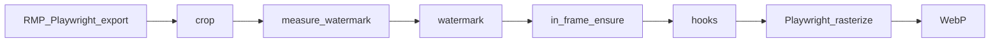

# rmp-export-action

English | [简体中文](README.zh-CN.md)


> The following content was generated by Cursor Auto and has not been manually reviewed. Please use it with caution.

GitHub Action and CLI that automate export of [Rail Map Painter](https://github.com/railmapgen/rmp) project JSON to SVG and WebP, as part of larger automation workflows.

The action clones a specified RMP version, starts it with `npm run dev`, drives the export UI with Playwright, post-processes SVG (crop, watermark, scripts), and generates WebP in the same browser environment.

**Typical use** is **tag-triggered GitHub Releases** in a map repository (as in [yanji-rail-transit-fiction](https://github.com/Unnamed2964/yanji-rail-transit-fiction)): push a version tag, export map assets in CI, and attach them to a Release for readers to view and download.

## Quick start

If you have an RMP map and host it on GitHub (or plan to), and want to **publish map images automatically**, start here.

**Steps**

1. Place `RMP.json` at the root of your map repository. Download [`example/rmp-release-config.yml`](example/rmp-release-config.yml) and copy it to the repository root as `rmp-release-config.yml`. Actions must be enabled on the repository (enabled by default on new repositories).
2. Set `acceptRmpExportTermsForRef` to the same value as `rmp.ref`. **By using this tool, you agree to that delegation** (during export it checks RMP’s export-terms agreement on your behalf). Setting this field also records that you have read the terms for that version and are entitled to export and publish map images under them.
3. Download [`example/release.yml`](example/release.yml) and copy it to `.github/workflows/release.yml` in your map repository.
4. Commit and push to GitHub.
5. Create and push a semantic version tag locally, for example `git tag v0.1.0 && git push origin v0.1.0`. The version after removing the leading `v` will be written to the `%version%` placeholder in your project JSON.
6. When the workflow runs successfully, open **Releases** on the repository (in the right sidebar on the repository home page) to view the new version. You can download SVG and WebP from the release attachments, and see WebP inline in the release notes.

## RMP export terms (required)

Using this tool to export SVG/WebP automatically requires you to comply with the **export terms** RMP applies to that version. During export, this tool checks RMP’s export-terms agreement on your behalf.

**By using this tool, you agree to that delegation.**

Your config must record that you have read and agree to those terms, and that you are entitled to export and publish map images under them.

**The terms text follows the RMP version in `rmp.ref`.** Terms may differ by version; if the text differs, what applies is what that version shows when the action runs.

1. Open the **same RMP version** as `rmp.ref` and read its export terms.
2. Set in `rmp-release-config.yml` (must **exactly match** `rmp.ref`):

```yaml
acceptRmpExportTermsForRef: rmp-6.0.22

rmp:
  ref: rmp-6.0.22
```

Setting `acceptRmpExportTermsForRef` to the same value as `rmp.ref` records that you have read and agree to the terms, and that **by using this tool you agree to that delegation**. After changing `rmp.ref`, re-read the terms and update this field.

## Adjusting parameters

### GitHub Action inputs

| Input | When to change | Required | Default | Description |
|-------|----------------|----------|---------|-------------|
| `version` | Every release | yes | — | Release version; see [Placeholders](#placeholders-version--datetime) below |
| `config` | Config file in a subdirectory | no | `rmp-release-config.yml` | Path to release config (relative to the calling repository root) |
| `export-id` | Export only one target | no | — | Must match the `id` of an entry under `exports` in the config |
| `dry-run` | Trial run without generating images | no | `false` | Set to `"true"` to log the plan only |

Example with optional inputs:

```yaml
- uses: Unnamed2964/rmp-export-action@v0
  with:
    version: "0.6.3"
    config: rmp-release-config.yml
    # export-id: map
    # dry-run: "true"
```

### Placeholders `%version%` / `%datetime%`

You can type `%version%` and `%datetime%` anywhere in RMP (they may sit directly next to other characters without spaces — for example, `Generated at %datetime%`). At run time this tool replaces them with actual values before importing the project into RMP — commonly used for version labels or “last updated” text on the map.

| Placeholder | Replaced with | Source |
|-------------|---------------|--------|
| `%version%` | Version with a `v` prefix, e.g. `v0.6.3` | The workflow `version` input; tag-release workflows usually derive this from the tag (`v0.6.3` → `v0.6.3`) |
| `%datetime%` | Export time, e.g. `2026-08-31T12:00:00` | Generated at the start of the run (Asia/Shanghai) |

The `version` input may be `0.6.3` or `v0.6.3`; both are normalized to the `v`-prefixed form when substituted.

### `rmp-release-config.yml` configuration example

Paths in the config are relative to the config file's parent directory. The YAML below adds field comments on top of [`example/rmp-release-config.yml`](example/rmp-release-config.yml) (`#fieldName: …` explains what the field is, or what happens when it is set or present):

```yaml
# acceptRmpExportTermsForRef: Which RMP export terms you agree to; must exactly match rmp.ref
acceptRmpExportTermsForRef: rmp-6.0.22

# rmp: Which RMP repository and version to run for automated export
rmp:
  # repository: Git URL of the RMP repository
  repository: https://github.com/railmapgen/rmp.git
  # ref: RMP version tag to use. You can try the RMP version from when you saved the project. The UI varies by version; this repository cannot currently guarantee that its UI automation works with every RMP version — when it does not, roll back to a version this repository currently supports
  ref: rmp-6.0.22

# defaults: Defaults for WebP generation; applies only when an export entry sets outputs.webp
defaults:
  # scale: WebP scale factor relative to the SVG
  scale: 2.0
  # whiteBackground: When true, WebP is rasterized on a white background
  whiteBackground: true

# exports: List of export targets; each maps one source file to output paths
exports:
  # id: Export target name
  # skip: When true, skip this entry
  - id: map
    # source: Path to the RMP project JSON
    source: RMP.json
    # outputs: Output file paths
    outputs:
      # svg: Path for the exported SVG
      svg: RMP.svg
      # webp: When set, WebP is generated; omit to skip WebP
      webp: RMP.webp
    # crop: Optional; when present, updates the exported SVG root viewBox (display clip only, not line geometry). In RMP, move new stations or virtual nodes to the intended top-left and bottom-right corners of the crop region, note their coordinates, and use them to fill in the values below
    crop:
      # x: Top-left x of the crop region
      x: 0
      # y: Top-left y of the crop region
      y: 0
      # width: Bottom-right x minus top-left x
      width: 1000
      # height: Bottom-right y minus top-left y
      height: 1000
    # watermark: Optional; when present, repositions the RMP watermark (#rmp_info in SVG); moved in-frame with a warning if needed
    watermark:
      # anchor: Which canvas corner to align to — bottom-right / bottom-left / top-right / top-left
      anchor: bottom-right
      # inset: Gap between the watermark bbox and the viewBox edge (used with anchor)
      inset:
        # x: Horizontal inset (for bottom-right anchor, distance from the right edge)
        x: 27
        # y: Vertical inset (for bottom-right anchor, distance from the bottom edge)
        y: 55
    # postProcess: Optional; when hooks are set, runs after crop/watermark and before WebP
    # postProcess:
    #   hooks:
    #     - type: command
    #       run: python3 scripts/my_hook.py RMP.svg
```

When upgrading `rmp.ref`, re-read the export terms and update `acceptRmpExportTermsForRef` accordingly.

## Troubleshooting

| Symptom / log | Likely cause | Suggested action |
|---------------|--------------|------------------|
| `acceptRmpExportTermsForRef is required` | Terms confirmation field unset | Read the RMP export terms for that version and set the field; see [RMP export terms](#rmp-export-terms-required) |
| `acceptRmpExportTermsForRef (...) must match rmp.ref (...)` | Terms field out of sync after ref change | Re-read terms for the new RMP version and set both fields to the same value |
| `exports must not be empty` | Empty `exports` list | Add at least one entry under `exports` |
| `rmp.repository and rmp.ref are required` | Missing required fields under `rmp` | Set `repository` and `ref` under `rmp` correctly |
| `No export target matched` | `export-id` does not map to an `exports[].id` | Align the workflow input with your config |
| `Hook failed: ...` | Post-process script failed | Check script paths under `postProcess` in `rmp-release-config.yml`; if you do not use hooks, remove any accidental `hooks` block |
| `Timed out waiting for` RMP URL | Slow clone/install or invalid `rmp.ref` | On the repository **Actions** tab, open the failed run and read the log; check that `rmp.ref` is spelled correctly and that the tag exists on the RMP repository |
| Playwright timeout / `session-open-failure` | RMP failed to start or load | Same as above — read the Actions log; confirm `rmp.ref` is valid. You can temporarily set it back to the RMP version from when you saved the project |
| `export-failure` | RMP UI error during SVG export | Automation was developed against RMP 6.0.22; if you recently upgraded `rmp.ref` and it is temporarily incompatible, set it back to the version from when you saved the project, or report on [Issues](https://github.com/Unnamed2964/rmp-export-action/issues) |
| `rasterize-failure` / `SVG missing viewBox and width/height` | SVG-to-WebP conversion failed | Check whether `crop` coordinates look reasonable; try removing `crop` once to test |
| `Unknown watermark anchor` / `watermark requires absolute or anchor+inset` | Invalid watermark config | Compare your `watermark` block with [Advanced topics](#advanced-topics) |
| CI output differs from local Windows | **Known issue** ([#1](https://github.com/Unnamed2964/rmp-export-action/issues/1)): CI and Windows use different fonts, so Chinese layout may differ from local RMP preview | Treat SVG/WebP in the Release attachments as canonical; see [#1](https://github.com/Unnamed2964/rmp-export-action/issues/1) for background |
| Release / Artifacts missing attachments | Upload step or path misconfigured | Compare your workflow upload paths with [`example/release.yml`](example/release.yml) or [`example/export-map.yml`](example/export-map.yml) |

**Debugging tips**

- Temporarily add `dry-run: "true"` to the workflow and run to validate config and placeholders without generating images.
- On the repository **Actions** tab, open the failed run and expand the red step to read the log; error names in the log usually match the table above.
- If you recently changed `rmp.ref` and the export dialog changed so this repository is temporarily incompatible, set it back to the RMP version from when you saved the project and try again.

## Advanced topics

Details not covered above.

### Post-process scripts

`postProcess.hooks` run after crop and watermark steps and before WebP generation. They can invoke any shell command to modify the SVG. The literal `RMP.svg` in `run` is replaced with the actual SVG output path for that export target.

For example, [yanji-rail-transit-fiction](https://github.com/Unnamed2964/yanji-rail-transit-fiction) calls `scripts/adjust_zh_dy.py` in its [`rmp-release.yml`](https://github.com/Unnamed2964/yanji-rail-transit-fiction/blob/main/rmp-release.yml) to raise Chinese station-name `dy` by 1px in the exported SVG to avoid overlap between Chinese and Korean text:

```yaml
postProcess:
  hooks:
    - type: command
      run: python3 scripts/adjust_zh_dy.py RMP.svg
```

If the same export target also sets `outputs.webp`, these changes are reflected in the WebP generated afterward.

### Absolute watermark positioning

Besides `anchor` + `inset`, you can use `absolute` coordinates:

```yaml
watermark:
  absolute:
    x: 100
    y: 200
```

### Skipping an export target

```yaml
exports:
  - id: draft
    skip: true
    source: RMP.json
    outputs:
      svg: draft.svg
```

### Processing order

The processing order for each export target is as follows:



### Other workflow examples

[`example/release.yml`](example/release.yml) is the tag-release workflow used in Quick start, including release notes and an inline preview image. For multiple assets or changelog customization, see [yanji-rail-transit-fiction’s release workflow](https://github.com/Unnamed2964/yanji-rail-transit-fiction/blob/main/.github/workflows/release.yml).

[`example/export-map.yml`](example/export-map.yml) is for manual export (`workflow_dispatch`); outputs are uploaded as Artifacts. Copy it to `.github/workflows/export-map.yml` in your map repository.

### Local CLI

Uses the same engine as the GitHub Action:

```bash
npm ci
npm run build
npx playwright install chromium
node dist/cli.js --config /path/to/rmp-release-config.yml --version 0.6.3
```

Optional arguments: `--export-id <id>`, `--dry-run`. Requires Node 20+, git, and network access to clone RMP.

When running locally, screenshots and Playwright traces under `.tmp/debug` are kept, which helps diagnose UI issues.

### Caching

Under `.cache/rmp/<ref>/` in your map repository, the RMP clone and `npm ci` output can persist across runs on self-hosted runners. GitHub-hosted runners use a fresh environment for each job by default; add a cache step for `.cache/rmp` to speed up later runs.

## License

MIT — see [LICENSE](LICENSE).
