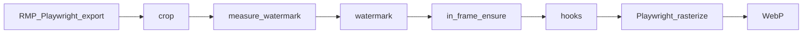

# rmp-export-action

[➡️ English](README.en.md) | 简体中文


> 以下部分内容由 Cursor Auto 生成，但经过人工检查和修改

GitHub Action 与 CLI，用于将 [Rail Map Painter](https://github.com/railmapgen/rmp) 项目 JSON 自动化地导出为 SVG 与 WebP，并用于组成更大的自动化过程。

本 Action 克隆指定版本的 RMP 并在浏览器中启动，通过 Playwright 代为操作导出界面，再对 SVG 做裁剪、水印移动、自定义脚本等后处理，然后生成 WebP。

> [!WARNING]
>
> 使用本工具自动导图，须遵守 RMP 对相应版本规定的**导出条款**，**条款文本以 Action 实际运行时为准**。
>
> 导出过程中，本工具会代你勾选 RMP 的「同意导出条款」。填写 `acceptRmpExportTermsForRef`，并与 `rmp.ref` 完全一致，**即表示你同意这一代为勾选。**

## 快速入门

假设你现在有一个 GitHub 仓库，其内有一个 RMP 存档，希望实现 RMP 存档随语义化版本号自动导图并创建发布。

**操作步骤**

1. 下载 [`example/rmp-release-config.yml`](example/rmp-release-config.yml) 并复制为 `rmp-release-config.yml` 到仓库根目录，将其中的 `RMP.json` 改为相对于仓库根目录的相对路径。仓库须已开启 Actions（新仓库默认应已开启）。
2. 把 `acceptRmpExportTermsForRef` 设为与 `rmp.ref` 一致的值。**进行此设置即表示你同意本工具在运行过程中代你勾选 RMP 导出条款**。
3. 下载 [`example/release.yml`](example/release.yml) 并复制到仓库下的 `.github/workflows/release.yml`。
4. 提交并推送更改至 GitHub。
5. 在本地创建并推送语义化版本号标签，例如 `git tag v0.1.0 && git push origin v0.1.0`（根据你需要的版本号修改）。含 `v` 前缀的版本号将会被写进 RMP 存档中的 `%version%` 占位符。
6. workflow 运行成功后，到仓库 **Releases** 页面（你可在仓库主页右栏找到）查看新版本；此时可以在附件中下载 SVG 和 WebP，也可以在发布正文中看到导出的 WebP 图。

## 参数

### GitHub Action 输入

| 项目 | 含义               | 必填 | 默认值 | 说明 |
|-------|----------|------|--------|------|
| `version` | 版本号 | 是 | — | 发布版本号；见下方 [占位符](#占位符-version--datetime) |
| `config` | 配置文件路径 | 否 | `rmp-release-config.yml` | 发布配置文件路径（相对于调用仓库根目录） |
| `export-id` | 只导出某一个目标 | 否 | — | 要与配置中某条 `exports` 的 `id` 一致 |
| `dry-run` | 试运行但不生成产物 | 否 | `false` | 设为 `"true"` 时只打印计划 |

```yaml
- uses: Unnamed2964/rmp-export-action@v0
  with:
    version: "0.6.3"
    config: rmp-release-config.yml
    # export-id: map
    # dry-run: "true"
```

### `rmp-release-config.yml` 配置示例

配置文件的路径都相对于本文件所在目录。

```yaml
# acceptRmpExportTermsForRef: 参见文首 warning；必须与 rmp.ref 完全一致
acceptRmpExportTermsForRef: rmp-6.0.22

rmp:
  # repository: RMP 的 git 仓库地址
  repository: https://github.com/railmapgen/rmp.git
  # ref: 指定的 RMP 版本 tag
  # 建议填写你正在使用的 RMP 版本号。
  # 本仓库不保证采用的自动操作方式能够在将来的 RMP 版本中有效
  # 如果发生这种情况，回退到本仓库适配的版本可能可以作为临时措施
  ref: rmp-6.0.22

# defaults: 可选；未在单条 exports 中指定的 scale / whiteBackground 使用此处值
# 若 defaults 与单条 exports 均未指定，则 scale 默认为 2.0、whiteBackground 默认为 true
defaults:
  # scale: Playwright 设备缩放倍数，影响该次导出会话的渲染与 WebP 分辨率
  scale: 2.0
  # whiteBackground: 生成 WebP 时为 true 则白色背景，否则透明背景
  whiteBackground: true

# exports: 导出目标列表；每条对应一个 source 与一组输出文件
exports:
  # id: 导出目标名称
  # skip: 为 true 时跳过本条
  - id: map
    # source: RMP 存档路径
    source: RMP.json
    # scale / whiteBackground: 可选；覆盖 defaults，适合多张画幅不同的线路图
    # scale: 2.5
    # whiteBackground: false
    # outputs: 导出文件在 workflow 中的路径
    outputs:
      # 以下两项均可选
      svg: RMP.svg
      webp: RMP.webp
    # crop: 可选；若存在则将输出进行裁剪，坐标系为 RMP 坐标系
    # 你可以在 RMP 中把新建车站或虚拟节点移到打算作为裁剪区左上角和右下角的位置，记下它们的坐标来确认以下数值
    crop:
      # x: 裁剪区左上角 x
      x: 0
      # y: 裁剪区左上角 y
      y: 0
      # width: 裁剪区宽度，右下角 x 减左上角 x
      width: 1000
      # height: 裁剪区高度，右下角 y 减左上角 y
      height: 1000
    # watermark: 可选；将 RMP 水印移到指定位置；指定位置超出裁剪区（可见范围）时将会移入画布最近位置并警告
    watermark:
      # anchor: 水印贴靠画布哪一角；取 bottom-right / bottom-left / top-right / top-left
      anchor: bottom-right
      # inset: 水印边缘（bbox）距离裁剪区（可见范围）相应边缘的间距
      inset:
        x: 27
        y: 55
    # postProcess: 可选；若存在则在裁剪、水印之后、生成 WebP 之前运行
    # postProcess:
    #   hooks:
    #     - type: command
    #       run: python3 scripts/my_hook.py RMP.svg
```

### 占位符 `%version%` / `%datetime%`

你可以在 RMP 存档中的任意位置输入 `%version%` 和 `%datetime%`（前后都可以直接接字符，不需要空格隔开），本工具将会自动替换为实际值。可用于线路图上的版本号、更新时间等文字。

| 占位符       | 替换结果                             | 来源                                |
| ------------ | ------------------------------------ | ----------------------------------- |
| `%version%`  | 带 `v` 前缀的版本号，例如 `v0.6.3`   | workflow 的 `version` 输入          |
| `%datetime%` | 导出时刻，例如 `2026-08-31T12:00:00` | 该次运行开始时生成（Asia/Shanghai） |

## 故障排查

| 现象 / 日志 | 可能原因 | 建议处理 |
|-------------|----------|----------|
| `acceptRmpExportTermsForRef is required` | 条款确认字段未设置 | 确认对应版本的 RMP 导出条款并设置该字段。见开头 warning |
| `acceptRmpExportTermsForRef (...) must match rmp.ref (...)` | 修改 ref 后条款字段尚未同步 | 确认 ref 版本 RMP 条款，将两个字段设为相同值。见开头 warning |
| `exports must not be empty` | `exports` 列表是空的 | 在 `exports` 下至少加一条 |
| `rmp.repository and rmp.ref are required` | `rmp` 段缺少必填项 | 在 `rmp` 下正确填写 `repository` 和 `ref` |
| `No export target matched` | `export-id` 不是任何一个 `exports[].id` | 核对 workflow 输入和配置文件 |
| `Hook failed: ...` | 后处理脚本运行失败 | 核对 `rmp-release-config.yml` 里 `postProcess` 的脚本路径；若未使用后处理，检查是否误加了 `hooks` |
| `Timed out waiting for` RMP URL | 克隆或安装太慢，或者 `rmp.ref` 无效 | 在仓库 **Actions** 页打开失败运行，查看日志；核对 `rmp.ref` 是否拼写正确、该 tag 在 RMP 仓库是否存在 |
| Playwright 超时 / `session-open-failure` | RMP 启动或加载出问题 | 同上查看 Actions 日志；确认 `rmp.ref` 有效。也有可能本 Action 暂不支持该 RMP 版本，可前往 [Issues](https://github.com/Unnamed2964/rmp-export-action/issues) 反馈 |
| `export-failure` | SVG 导出时 RMP 界面操作失败 | 本工具基于 RMP 6.0.22 开发，不一定支持未来的 RMP 版本；若刚升级 `rmp.ref`，可先改回之前的版本号，并可前往 [Issues](https://github.com/Unnamed2964/rmp-export-action/issues) 反馈 |
| `rasterize-failure` / `SVG missing viewBox and width/height` | SVG 转 WebP 失败 | 核对 `crop` 坐标是否合理；可暂时去掉 `crop` 试一次 |
| `Unknown watermark anchor` / `watermark requires absolute or anchor+inset` | watermark 配置无效 | 检查 `watermark` 写法 |
| CI 输出与本地 Windows 不一致 | **已知问题**（[#1](https://github.com/Unnamed2964/rmp-export-action/issues/1)）：CI 与 Windows 可用字体不同，中文排版可能与本地 RMP 预览不一样 | 以 Release 附件中的 SVG/WebP 为准；详情与背景见 [#1](https://github.com/Unnamed2964/rmp-export-action/issues/1) |
| Release / Artifacts 缺少附件 | upload 步骤或路径配错了 | 对照 [`example/release.yml`](example/release.yml) 或 [`example/export-map.yml`](example/export-map.yml) 检查 workflow 里的上传路径 |

## 高级主题

以下内容为前文未展开的细节。

### 后处理脚本

`postProcess.hooks` 在裁剪、水印等步骤之后、生成 WebP 之前执行，可调用任意 shell 命令修改 SVG。`run` 中的字面量 `RMP.svg` 会替换为该导出目标实际的 SVG 输出路径。

例如 [yanji-rail-transit-fiction](https://github.com/Unnamed2964/yanji-rail-transit-fiction) 在其 [`rmp-release.yml`](https://github.com/Unnamed2964/yanji-rail-transit-fiction/blob/main/rmp-release.yml) 中调用 `scripts/adjust_zh_dy.py`，将导出 SVG 里中文站名的 `dy` 抬升 1px，以避免中文和朝鲜文重叠：

```yaml
postProcess:
  hooks:
    - type: command
      run: python3 scripts/adjust_zh_dy.py RMP.svg
```

同一导出目标若同时配置 `outputs.webp`，上述修改会反映在随后生成的 WebP 中。

### 水印的绝对定位

除 `anchor` + `inset` 外，可用 `absolute` 指定坐标：

```yaml
watermark:
  absolute:
    x: 100
    y: 200
```

### 跳过某一导出目标

```yaml
exports:
  - id: draft
    skip: true
    source: RMP.json
    outputs:
      svg: draft.svg
```

### 处理顺序

每个导出目标的处理顺序如下：



### 其他 workflow 示例

[`example/export-map.yml`](example/export-map.yml) 用于手动导出（`workflow_dispatch`），产物上传为 Artifacts。复制到地图仓库的 `.github/workflows/export-map.yml` 即可使用。

[yanji-rail-transit-fiction 的 release workflow](https://github.com/Unnamed2964/yanji-rail-transit-fiction/blob/main/.github/workflows/release.yml) 是一个具有多图、对比上一版变更等的例子。

### 本地 CLI

和 GitHub Action 用的是同一套引擎：

```bash
npm ci
npm run build
npx playwright install chromium
node dist/cli.js --config /path/to/rmp-release-config.yml --version 0.6.3
```

可选参数：`--export-id <id>`、`--dry-run`。需要 Node 20+、git，以及能克隆 RMP 的网络。

本地运行时，`.tmp/debug` 中的截图和 Playwright trace 会保留，便于排查 UI 问题。

### 缓存

RMP 克隆和 `npm ci` 的结果存储在 `.cache/rmp/<ref>/` 下。在 GitHub 环境下若希望加速运行，你可将 `.cache/rmp` 添加至 cache。

## 许可证

MIT — 见 [LICENSE](LICENSE)。
