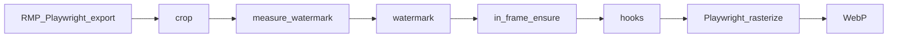

# rmp-export-action

[➡️ English](README.en.md) | 简体中文


> 以下内容由 Cursor Auto 生成，尚未经人工核对，请谨慎对待。

GitHub Action 与 CLI，用于将 [Rail Map Painter](https://github.com/railmapgen/rmp) 项目 JSON 自动化地导出为 SVG 与 WebP，并用于组成更大的自动化过程。

本 Action 克隆指定版本的 RMP，以 `npm run dev` 启动，通过 Playwright 操作导出界面，再对 SVG 做后处理（裁剪、水印、脚本），并在同一浏览器环境中生成 WebP。

**典型用法**是在地图仓库中配置 **打 tag 自动发布 GitHub Release**（与 [yanji-rail-transit-fiction](https://github.com/Unnamed2964/yanji-rail-transit-fiction) 类似）：推送版本 tag 后自动导出成图，挂在 Release 页面上，供读者查看与下载。

## 快速入门

如果你有一张 RMP 线路图，并准备或已经在 GitHub 上托管它，想在 GitHub 上快速实现 **自动发布成图**，可以从这里开始。

**操作步骤**

1. 把 `RMP.json` 放在地图仓库根目录，下载 [`example/rmp-release-config.yml`](example/rmp-release-config.yml) 并复制为 `rmp-release-config.yml` 到地图仓库根目录。仓库须已开启 Actions（新仓库默认应已开启）。
2. 把 `acceptRmpExportTermsForRef` 设为与 `rmp.ref` 一致的值。**使用本工具即表示你同意这一代理**（导出过程中本工具会代你勾选 RMP 导出条款）；设该字段还表示你已阅读对应版本的条款，并确认你有权按该条款导出并发布成图。
3. 下载 [`example/release.yml`](example/release.yml) 并复制到地图仓库的 `.github/workflows/release.yml`。
4. 提交并推送至 GitHub。
5. 在本地创建并推送语义化版本号标签，例如 `git tag v0.1.0 && git push origin v0.1.0`。去掉 `v` 后的版本号将会被写进项目 JSON 中的 `%version%` 占位符。
6. workflow 运行成功后，到仓库 **Releases** 页面（你可在仓库主页右栏找到）查看新版本；此时可以在附件中下载 SVG 和 WebP，也可以在发布正文中看到 WebP。

## RMP 导出条款（必填）

使用本工具自动导出 SVG/WebP，须遵守 RMP 对相应版本规定的**导出条款**。导出过程中，本工具会代你勾选 RMP 的「同意导出条款」。

**使用本工具即表示你同意这一代理。**

请在配置中确认：你已阅读并同意这些条款，且你有权按该条款导出并发布成图。

**条款文本以 `rmp.ref` 所指的 RMP 版本为准**；不同版本条款可能不同，以 Action 实际运行时该版本所示为准。

1. 打开与 `rmp.ref` **同一版本**的 RMP，阅读其导出条款。
2. 在 `rmp-release-config.yml` 中设置（须与 `rmp.ref` **完全一致**）：

```yaml
acceptRmpExportTermsForRef: rmp-6.0.22

rmp:
  ref: rmp-6.0.22
```

`acceptRmpExportTermsForRef` 取值与 `rmp.ref` 相同，即表示你已阅读并同意条款，且**使用本工具即表示你同意这一代理**。修改 `rmp.ref` 后，须重新阅读条款并更新该字段。

## 调整参数

### GitHub Action 输入

| Input | 何时修改 | 必填 | 默认值 | 说明 |
|-------|----------|------|--------|------|
| `version` | 每次发布 | 是 | — | 发布版本号；见下方 [占位符](#占位符-version--datetime) |
| `config` | 配置文件位于子目录时 | 否 | `rmp-release-config.yml` | 发布配置文件路径（相对于调用仓库根目录） |
| `export-id` | 只导出某一个目标 | 否 | — | 要与配置中某条 `exports` 的 `id` 一致 |
| `dry-run` | 试运行但不生成图片 | 否 | `false` | 设为 `"true"` 时只打印计划 |

含可选输入的示例：

```yaml
- uses: Unnamed2964/rmp-export-action@v0
  with:
    version: "0.6.3"
    config: rmp-release-config.yml
    # export-id: map
    # dry-run: "true"
```

### 占位符 `%version%` / `%datetime%`

你可以在 RMP 中的任意地方输入 `%version%` 和 `%datetime%`（前后都可以直接接字符，不需要空格隔开等，例如「生成时间是%datetime%」）。本工具在运行时将会自动替换为实际值，再导入 RMP，常用于线路图上的版本号、更新时间等文字。

| 占位符 | 替换结果 | 来源 |
|--------|----------|------|
| `%version%` | 带 `v` 前缀的版本号，例如 `v0.6.3` | workflow 的 `version` 输入；tag 发布 workflow 通常从 tag 解析（`v0.6.3` → `v0.6.3`） |
| `%datetime%` | 导出时刻，例如 `2026-08-31T12:00:00` | 该次运行开始时生成（Asia/Shanghai） |

`version` 输入写 `0.6.3` 或 `v0.6.3` 都可以，替换时都会变成带 `v` 前缀的形式。

### `rmp-release-config.yml` 配置示例

配置中的路径都相对于该文件所在目录。下列 YAML 在 [`example/rmp-release-config.yml`](example/rmp-release-config.yml) 基础上加了字段说明注释（`#字段名: …` 说明该字段是什么，或存在/取某值时的效果）：

```yaml
# acceptRmpExportTermsForRef: 你同意哪一版 RMP 导出条款；必须与 rmp.ref 完全一致
acceptRmpExportTermsForRef: rmp-6.0.22

# rmp: 从哪个仓库、哪个版本拉取 RMP 用于自动导出
rmp:
  # repository: RMP 的 git 仓库地址
  repository: https://github.com/railmapgen/rmp.git
  # ref: 指定的 RMP 版本 tag。你可以尝试填写制作存档时用的 RMP 版本号。界面随版本变化，本仓库暂时不能保证其 UI 自动操作方式能够在所有 RMP 版本中都有效；当这种情况发生时，你需要回退到本仓库暂时适配的版本
  ref: rmp-6.0.22

# defaults: 生成 WebP 时的默认参数；仅当某条 exports 填写了 outputs.webp 时生效
defaults:
  # scale: WebP 相对 SVG 的缩放倍数
  scale: 2.0
  # whiteBackground: 为 true 时 WebP 铺白色背景
  whiteBackground: true

# exports: 导出目标列表；每条对应一个 source 与一组输出文件
exports:
  # id: 导出目标名称
  # skip: 为 true 时跳过本条
  - id: map
    # source: RMP 项目 JSON 路径
    source: RMP.json
    # outputs: 导出文件路径
    outputs:
      # svg: 导出的 SVG 路径
      svg: RMP.svg
      # webp: 填写则生成 WebP；省略则不生成
      webp: RMP.webp
    # crop: 可选；若存在则修改导出 SVG 根 viewBox（只改显示范围，不改线路几何）。你可以在 RMP 中把新建车站或虚拟节点移到打算作为裁剪区左上角和右下角的位置，记下它们的坐标来确认以下数值
    crop:
      # x: 裁剪区左上角 x
      x: 0
      # y: 裁剪区左上角 y
      y: 0
      # width: 右下角 x 减左上角 x
      width: 1000
      # height: 右下角 y 减左上角 y
      height: 1000
    # watermark: 可选；若存在则重新放置 RMP 水印（SVG 内 #rmp_info）；越界时移入画布并 warning
    watermark:
      # anchor: 水印贴靠画布哪一角；取 bottom-right / bottom-left / top-right / top-left
      anchor: bottom-right
      # inset: 水印 bbox 与 viewBox 边缘的间距（与 anchor 配合）
      inset:
        # x: 水平边距（如 anchor 为 bottom-right 时表示距右边缘）
        x: 27
        # y: 垂直边距（如 anchor 为 bottom-right 时表示距下边缘）
        y: 55
    # postProcess: 可选；若存在 hooks 则在裁剪、水印之后、生成 WebP 之前运行
    # postProcess:
    #   hooks:
    #     - type: command
    #       run: python3 scripts/my_hook.py RMP.svg
```

升级 `rmp.ref` 时，请重新阅读导出条款，并同步更新 `acceptRmpExportTermsForRef`。
## 故障排查

| 现象 / 日志 | 可能原因 | 建议处理 |
|-------------|----------|----------|
| `acceptRmpExportTermsForRef is required` | 条款确认字段未设置 | 阅读对应版本的 RMP 导出条款并设置该字段；见 [RMP 导出条款](#rmp-导出条款必填) |
| `acceptRmpExportTermsForRef (...) must match rmp.ref (...)` | 修改 ref 后条款字段尚未同步 | 用新版本 RMP 重读条款，将两个字段设为相同值 |
| `exports must not be empty` | `exports` 列表是空的 | 在 `exports` 下至少加一条 |
| `rmp.repository and rmp.ref are required` | `rmp` 段缺少必填项 | 在 `rmp` 下正确填写 `repository` 和 `ref` |
| `No export target matched` | `export-id` 和 `exports[].id` 对不上 | 核对 workflow 输入和配置文件 |
| `Hook failed: ...` | 后处理脚本运行失败 | 核对 `rmp-release-config.yml` 里 `postProcess` 的脚本路径；若未使用后处理，检查是否误加了 `hooks` |
| `Timed out waiting for` RMP URL | 克隆或安装太慢，或者 `rmp.ref` 无效 | 在仓库 **Actions** 页打开失败运行，查看日志；核对 `rmp.ref` 是否拼写正确、该 tag 在 RMP 仓库是否存在 |
| Playwright 超时 / `session-open-failure` | RMP 启动或加载出问题 | 同上查看 Actions 日志；确认 `rmp.ref` 有效。可暂时改回制作存档时用的 RMP 版本号 |
| `export-failure` | SVG 导出时 RMP 界面操作失败 | 本工具基于 RMP 6.0.22 开发；若刚升级 `rmp.ref` 导致暂时不适配，可先改回制作存档时用的 RMP 版本号，或到 [Issues](https://github.com/Unnamed2964/rmp-export-action/issues) 反馈 |
| `rasterize-failure` / `SVG missing viewBox and width/height` | SVG 转 WebP 失败 | 核对 `crop` 坐标是否合理；可暂时去掉 `crop` 试一次 |
| `Unknown watermark anchor` / `watermark requires absolute or anchor+inset` | watermark 配置无效 | 对照 [高级主题](#高级主题) 检查 `watermark` 写法 |
| CI 输出与本地 Windows 不一致 | **已知问题**（[#1](https://github.com/Unnamed2964/rmp-export-action/issues/1)）：CI 与 Windows 可用字体不同，中文排版可能与本地 RMP 预览不一样 | 以 Release 附件中的 SVG/WebP 为准；详情与背景见 [#1](https://github.com/Unnamed2964/rmp-export-action/issues/1) |
| Release / Artifacts 缺少附件 | upload 步骤或路径配错了 | 对照 [`example/release.yml`](example/release.yml) 或 [`example/export-map.yml`](example/export-map.yml) 检查 workflow 里的上传路径 |

**调试建议**

- 在 workflow 里临时加上 `dry-run: "true"` 运行，可只检查配置和占位符，不生成图片。
- 到仓库 **Actions** 页，点开失败的那次运行，展开红色步骤阅读日志；日志里的英文报错名通常对应上表。
- 刚改过 `rmp.ref` 时，若导出对话框有变化导致本仓库暂时不适配，可先改回制作存档时用的 RMP 版本号再试。

## 高级主题

以下内容为前文未展开的细节。

### 后处理脚本

`postProcess.hooks` 在裁剪、水印等步骤之后、生成 WebP 之前执行，可调用任意 shell 命令修改 SVG。`run` 中的字面量 `RMP.svg` 会替换为该导出目标实际的 SVG 输出路径。

例如 [yanji-rail-transit-fiction](https://github.com/Unnamed2964/yanji-rail-transit-fiction) 在其 [`rmp-release.yml`](https://github.com/Unnamed2964/yanji-rail-transit-fiction/blob/main/rmp-release.yml) 中调用 `scripts/adjust_zh_dy.py`，将导出 SVG 里中文站名的 `dy` 抬升 1px，以避免中文和朝鲜文重叠：

```yaml
postProcess:
  hooks:
    - type: command
      run: python3 scripts/adjust_zh_dy.py RMP.svg
```

同一导出目标若同时配置 `outputs.webp`，上述修改会反映在随后生成的 WebP 中。

### 水印的绝对定位

除 `anchor` + `inset` 外，可用 `absolute` 指定坐标：

```yaml
watermark:
  absolute:
    x: 100
    y: 200
```

### 跳过某一导出目标

```yaml
exports:
  - id: draft
    skip: true
    source: RMP.json
    outputs:
      svg: draft.svg
```

### 处理顺序

每个导出目标的处理顺序如下：



### 其他 workflow 示例

[`example/release.yml`](example/release.yml) 是快速入门所用的 tag 发布 workflow，含 Release 说明正文与配图。要多图、对比上一版变更等，可参考 [yanji-rail-transit-fiction 的 release workflow](https://github.com/Unnamed2964/yanji-rail-transit-fiction/blob/main/.github/workflows/release.yml)。

[`example/export-map.yml`](example/export-map.yml) 用于手动导出（`workflow_dispatch`），产物上传为 Artifacts。复制到地图仓库的 `.github/workflows/export-map.yml` 即可使用。

### 本地 CLI

和 GitHub Action 用的是同一套引擎：

```bash
npm ci
npm run build
npx playwright install chromium
node dist/cli.js --config /path/to/rmp-release-config.yml --version 0.6.3
```

可选参数：`--export-id <id>`、`--dry-run`。需要 Node 20+、git，以及能克隆 RMP 的网络。

本地运行时，`.tmp/debug` 中的截图和 Playwright trace 会保留，便于排查 UI 问题。

### 缓存

地图仓库 `.cache/rmp/<ref>/` 目录下，RMP 克隆和 `npm ci` 的结果可在自托管运行环境中跨多次运行保留。GitHub 托管运行环境默认每次 job 使用全新环境；可为 `.cache/rmp` 添加 cache 步骤以加速后续运行。

## 许可证

MIT — 见 [LICENSE](LICENSE)。
